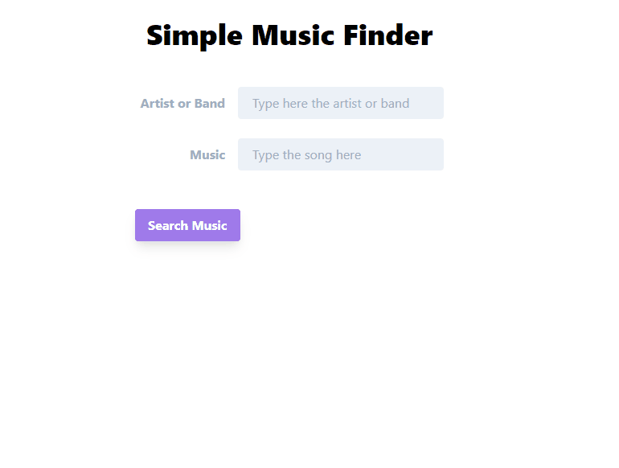

# Simple Music Finder

> 🚀 Projeto desenvolvido em HTML, JavaScript e CSS, com objetivo de explorar o uso da API [Lyrics](https://lyricsovh.docs.apiary.io/) e o framework [Tailwind CSS](https://tailwindcss.com/).

  <a href="#-requisitos">Requisitos</a>&nbsp;&nbsp;&nbsp;|&nbsp;&nbsp;&nbsp;
  <a href="#-tecnologias">Tecnologias</a>&nbsp;&nbsp;&nbsp;|&nbsp;&nbsp;&nbsp;
  <a href="#-autor">Autor</a>&nbsp;&nbsp;&nbsp;|&nbsp;&nbsp;&nbsp;
  <a href="#-contribuição">Contribuição</a>&nbsp;&nbsp;&nbsp;|&nbsp;&nbsp;&nbsp;
  <a href="#-licença">Licença</a>

### Simple Music Finder 🚀

### ⚙️ Requisitos

Não será necessário nenhuma instalação prévia para executar a página, apenas o mecanismo JavaScript do navegador. Opcionalmente você pode usar o editor de código [VSCode](https://code.visualstudio.com/)

### 🛠 Tecnologias

As seguintes ferramentas foram usadas na construção do projeto:

- [HTML](https://developer.mozilla.org/pt-BR/docs/Web/HTML)
- [Tailwind CSS](https://tailwindcss.com/)
- [JavaScript](https://developer.mozilla.org/pt-BR/docs/Web/JavaScript)

### 😎 Autor

Guilherme Ferrari - guile.ferrari@hotmail.com

### 🎯 Contribuição

1. Faça o _fork_ do projeto
2. Crie uma _branch_ para sua modificação (`git checkout -b feature/descricaoFeature`)
3. Faça o _commit_ (`git commit -am 'Add descricaoFeature'`)
4. _Push_ (`git push origin feature/descricaoFeature`)
5. Crie um novo _Pull Request_

### 📝 Licença

MIT.